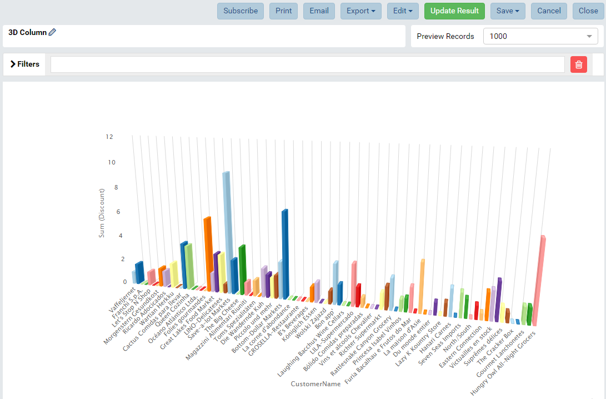
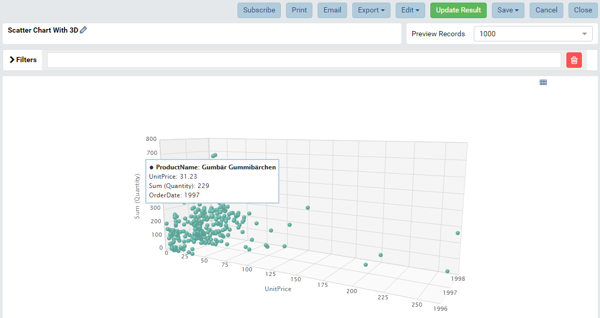
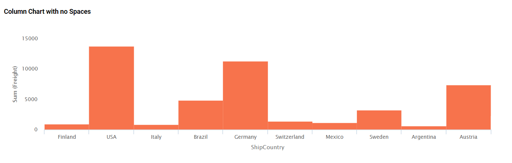

# Izenda Custom Visualizations

> _Note that this example is meant to demonstrate the flexibility of the Izenda JS API to adopt the various requirements on building a custom chart._

## Goal
-------

This project builds a library that can be used in place of the standard Izenda UI resources which allows customers to implement custom report part types.

### Sample Visualizations

This repo contains code examples showing how to customize or extend the Izenda visualizations using JS APIs. 


* D3
	- Timeline Chart
	- Google Map

* High Charts
	- 3D Column chart (/src/3d_column) demonstrates the ability of extending a column chart by adding an "Enable 3D" checkbox option into the property panel of the report designer. This is based on original 3D Highcharts examples at https://www.highcharts.com/docs/chart-concepts/3d-charts
  
	- 3D Scatter chart (/src/3d_scatter) demonstrates the ability of extending a scatter chart by adding an additional field container (Z-Axis Values) and rendering the scatter plot in a 3 dimensional chart.
  
	- Column No Space (/src/columnnospace) demonstrates the ability of extending a column chart by altering the padding between the columns to show no space between the groupings.
  

### Adding/Removing Custom Charts from Library


Review ./src/visualization.js . This includes "import" statements to each collection of vizualization resources.

### Defining a Custom Report Part Type

Each report part type has an Options Builder, Visualaztion Engine "VizEngine" , and index.js . Additoinal files may exist such as CSS files or helper files.

* Options Builder : Defines the Izenda "Report Part Properties" Menu Options such as Color Themes and Sorting.
* Viz Engine : Defines how the visualization should render within the platform. For HighCharts, the VizEngine is already built and defined by Izenda.
* index : A "root" location to load the Options Builder and Viz Engine into Izenda using IzendaSynergy endpoints documented on the Wiki.


## Setup

- Download EmbeddedUI.zip in Izenda download site.
- In the root directory, create the folder libs/IzendaSynergy and extract the EmbeddedUI.zip contents into libs/IzendaSynergy
- Change the WebAPIUrl value to Izenda Standalone BE API in /src/config.js
- Run following npm command to install all necessary node components.

```
npm install
```

### Start Dev Server

The following command will start a simple server where your front end will be accessible through localhost:8080 as a standalone site (Deployment Mode 0). 

```
npm run dev
```

### Build Prod Version

The following command will compile a production version of the library to be used in an integrated mode (1 or 3). The result will be found in a newly created ```/dist/``` directory.

```
npm run build
```

### Deployment

- Build a production version of the library using the command above.

- Copy the contents of the ```/dist/``` to your project's front end resources. In subsequent steps, we assume that the contents was copied from ```/dist/``` in this project to a ```/dist/``` directory in your application's project.

- Ensure that the file location in your project for the Izenda Embedded UI resources reflect their new location ```/dist/vendor/IzendaSynergy/``` . This will likely occur in your Webpack configuration or within your link references on your HTML page.

  e.g. ```<script type="text/javascript" src="/izenda_common.js?88e558d31eb83cb95e7b">``` may change to ```<script type="text/javascript" src="/dist/vendor/IzendaSynergy/izenda_common.js?88e558d31eb83cb95e7b">```

- Some samples do utilize JQuery 3.2.1. Whenever Izenda is on a page, you will need to ensure to load this resource as well

	e.g. ```<script type="text/javascript" src="https://unpkg.com/jquery@3.2.1/dist/jquery.min.js"></script> ```

- Ensure to load the "izenda_visualizations.js" file from the /dist/ directory on your page after the Izenda Embedded UI resources have loaded 

	e.g. ```<script type="text/javascript" src="izenda_visualizations.js"></script> ```

- Ensure to load the "izenda_visualizations.css" file from the /dist/ directory after your izenda-ui.css resource has loaded.

	e.g. ```<link href="/dist/izenda_visualizations.css" rel="stylesheet">```
	
- **Exports** : Ensure that any modifications made above are also refelected on the "Page To Render Export" located at the ```/viewer/reportpart/``` route of your application. 


### Upgrades

- The result of this project is a JavaScript library where the Izenda EmbeddedUI resources will exist in the vendor/IzendaSynergy/ directory.
- To upgrade to a later version of Izenda, replace the contents of vendor/IzendaSynergy/ in your application.
- Please review the Izenda Release notes before an upgrade. If there is a breaking change within the custom visualization code, this project may need to be recompiled for a successful upgrade.


## Adding New Visualizations

### Step 1 - Integrate Izenda UI library into Webpack configuration

To integrate Izenda UI library with Webpack build as the external library, we uses [html-webpack-externals-plugin](https://www.npmjs.com/package/html-webpack-externals-plugin) to simplify Izenda UI integration settings, let them automatically adjust the externals property of Webpack config, copy and bunble the Izenda UI assets to the output.

The configuration has been set in /webpack/webpack.common.js config file

```javascript
{
  // Name of module. It allows using import('IzendaSynergy') in the code regardless its location.
  // The plugin also uses the name of module when probbing Izenda UI file assets under /libs folder which is configured as the context path.
  module: 'IzendaSynergy',

  // The order of entry does matter. The lower entry depends on upper entry.
  entry: [
    {
      path: 'izenda-ui.css',
      type: 'css',
      cwpPatternConfig: {
        context: Path.resolve(__dirname, '../libs')
      }
    },
    {
      path: 'izenda_common.js',
      cwpPatternConfig: {
        context: Path.resolve(__dirname, '../libs')
      }
    },
    {
      path: 'izenda_locales.js',
      cwpPatternConfig: {
        context: Path.resolve(__dirname, '../libs')
      }
    },
    {
      path: 'izenda_vendors.js',
      cwpPatternConfig: {
        context: Path.resolve(__dirname, '../libs')
      }
    },
    {
      path: 'izenda_ui.js',
      cwpPatternConfig: {
        context: Path.resolve(__dirname, '../libs')
      }
    }
  ],
  // Additional assets that need to be copied into the output path
  supplements: [
    {
      path: 'assets/',
      cwpPatternConfig: {
        context: Path.resolve(__dirname, '../libs')
      }
    },
    {
      path: 'plugins/',
      cwpPatternConfig: {
        context: Path.resolve(__dirname, '../libs')
      }
    },
    {
      path: 'skins/',
      cwpPatternConfig: {
        context: Path.resolve(__dirname, '../libs')
      }
    },
    {
      path: 'themes/',
      cwpPatternConfig: {
        context: Path.resolve(__dirname, '../libs')
      }
    },
    // The source map files are optional.
    {
      path: 'izenda_ui.js.map',
      cwpPatternConfig: {
        context: Path.resolve(__dirname, '../libs')
      }
    },
    {
      path: 'izenda_vendors.js.map',
      cwpPatternConfig: {
        context: Path.resolve(__dirname, '../libs')
      }
    }
  ],

  // The name of module exported globally. It can be accessed using the global name.
  global: 'IzendaSynergy'
}
```

### Step 2 - Take a sample chart and start coding

The Izenda UI Javascript APIs offer multiple levels of customization for the built-in visualizations, e.g. chart, gauge or map, as well as the tool's user interface elements to ensure a better user experience just like the built-in functions.

Izenda's custom visualization API inherits configuration from the Izenda application, so you don't have to build custom charts, gauges or maps from scratch. With this approach, you can base your custom item off of an existing visualization. This allows you to write less code without sacrificing built-in features.

There are two common scenarios that the Izenda Javascript APIs can be used for:

1.  Making a custom chart type based on the standard Izenda visualization engines (Highcharts and Highmap)

    - IInherit and extend the options builder to change the Highchart/Highmap options in order to let it render the desired visualization. You must identify what chart options need to be set for 3D column, for example https://jsfiddle.net/highcharts/2fuRA, then populate the same options in the option builder.
    - Use `extendReportPartStyleConfiguration` function to create a custom chart type.

2.  Making a custom chart type with another new visualization engine, e.g. D3 data visualization, Bing/Google map...

    - Inherit and extend visualization engine (VizEngine, HighchartVizEngine, HighmapVizEngine). See `getClass` function to find out how to get the class.
    - Use `registerVisualizationEngine` to add a new visualization engine class.

Please read through the code example in src/3d_column and src/3d_scatter and the [API documents](https://www.izenda.com/docs/dev/api_frontend_integration.html)

### Credit:

The codebase was initiated from https://github.com/wbkd/webpack-starter
